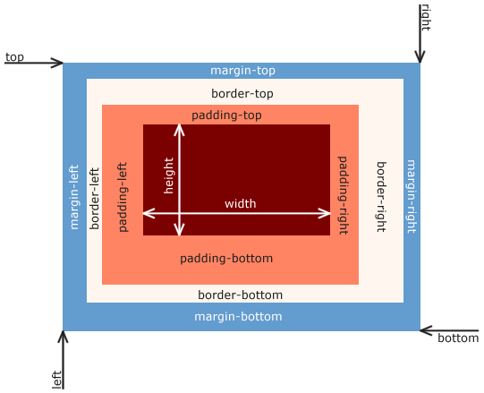

# Intro to CSS

## About us

### Omar Flores

- 4th year CS at Carleton University
- Software Engineer Intern at Google
- All things frontend
- [omarg247](https://github.com/omarg247) on GitHub
- [omarflores.dev](https://omarflores.dev) on the web
- [omarflores.dev/favorites](https://omarflores.dev/favorites) for resources that have helped me!

### Jason Le

- 4th year CS at Carleton University
- Developer (Intern) at RBC Amplify
- jqwotos on [Linkedin](https://www.linkedin.com/in/jqwotos/) and [Github](https://github.com/jqwotos)

## What is CSS?

According to MDN web docs (Mozilla Developer Network):

- Cascading Style Sheets (CSS) is a stylesheet language used to describe the presentation of a document written in HTML or XML (including XML dialects such as SVG, MathML or XHTML). CSS describes how elements should be rendered on screen, on paper, in speech, or on other media.

> **TL;DR** a way to style documents, most commonly HTML and SVG

## CSS seems scary

**Queue the horror music**

- "I hate CSS"
- "I can't center this div!"
- "I can't do CSS for my life"
- "WhAT iS CSs"

**Why does this happen?**

- Lack of true resources
- A lot of detailing
- If things aren't built properly from the beginning, you'll end up using `!important` EVERYWHERE

## Essentials

- [x] selectors
- [x] pseudo classes
- [x] box model
- [x] sizing units
- [x] position
- [x] layouts
- [x] transitions

## Selectors

- Elements vs divs vs id, what to use?
- Depends on the context

### Syntax

- `.class`
- `#id`
- `element`

**Classes**

```html
<div class="profile-container">
  
  <h3 class="profile-name">
    Omar
  </h3>
</div>
```

**What can we do with **this**?**

```css
.profile-container {
  display: flex;
  flex-direction: column;
  align-items: center;
  padding: 16px;
}

.profile-picture {
  height: 140px;
  width: 140px;
  border-radius: 100%;
}

.profile-name {
  margin-top: 32px;
}
```

**There is not a single way to use selectors**

### Syntax

- space -> another level in
- no space -> same element
- comma -> different element

```html
<div class="profile-container">
  
  <h3>
    Omar
  </h3>
</div>
```

```css
.profile-container {
  display: flex;
  flex-orientation: column;
  padding: 16px;
}

.profile-container img {
  height: 64px;
  width: 64px;
  border-radius: 100%;
}

.profile-container h3 {
  margin-top: 32px;
}
```

- SCSS

```css
.profile-container {
  display: flex;
  flex-orienation: column;

  & img {
    height: 64px;
    width: 64px;
    border-radious: 100%;
  }

  & h3 {
    margin-top: 32px;
  }
}
```

**Pseudo classes**

- `:hover`
- `:active`
- `:focus`
- `:visited`
- `:first`
- `:first-child`
- `:last-child`
- `not()`

**Can be combined**

- `:not(:first-child)`

```css
.profile-container img:hover {
  box-shadow: 4px 4px 12px rgba(0, 0, 0, 0.5);
}
```

## Box model



- height & width can be either relative or fixed
- padding goes inwards <<
- margin goes outwards >>

## Sizing units

**%**

- Size relative to to parent element
- Usually used when parent components have a set height/width

**px**

- Pixels
- Usually the standard for all units
- 8px

**rem "root element font size"**

- Size scalable to what the "root element of font size is"
- Usually set as 16px
- `em` stands for element font size, nearest font size is used

**vh, vw**

- Size relative to viewport
- Usually used in parent body, html, or main components

**Static one pager website**

```html
<body>
  <div class="main-container">
    <div class="profile-container">
      
    </div>
  </div>
</body>
```

```css
html,
body {
  height: 100vh;
  width: 100vw;
}

.main-container {
  padding: 1rem;
  height: 264px;
  width: 264px;
  display: flex;
}

.profile-container {
  margin: auto;
  padding: 1rem;
}

.profile-image {
  height: 100%;
  width: 100%;
}
```

## Position

**static**

- _Basic_
- The normal position

**relative**

- _Always taking care of their friends_
- Used to be able to use absolute in the children

**absolute**

- _wilding out only when they're with their friends_
- Relative to the closest parent component that has `position: relative` on it.
- If a parent is not relative, it will take the root as relative

**fixed**

- _Doesn't care about anything_
- Only relative to the root element

**sticky**

- _Can't be left behind_
- Will stay in the viewport and stick to its parent element

## Layouts

### Flexbox

**Flexbox is your friend**

- Will literally make your life easier

**How does it work?**

- `display: flex`
- `flex-direction`
  - column
  - row
- `flex-wrap`
  - wrap
  - no-wrap

**alignment**

- `align-items`
  - along direction axis
- `align-content`
  - aligns items in more than one row/column
- `justify-content`
  - opposite to direction axis

```css
.parent {
  display: flex;
  flex-direction: row;
  flex-wrap: nowrap;
}
```

**What happens on mobile?**

- Rows become columns

### Grids

#### Center everything!

- One of the most useful things about grids, they make it really easy to center elements. It's as simple as this

```css
.parent {
  display: grid;
  place-items: center;
}
```

#### Basics of CSS Grids

```css
.parent {
  display: grid;
}
```

**Grid Tracks**

- Grid Tracks define the **rows** and **columns** of our grid layout through the use of: `grid-template-columns`, `grid-template-rows`, and the short-hand `grid-template`.

```css
.parent {
  grid-template-columns: 1fr 2fr 3fr;
  grid-template-rows: auto;

  display: grid;
}
```

We define the columns and rows for the grid. Here we have a grid with three columns: the first column will take up 1 / 6 of the space, second column will take up 2 / 6 of the space, the third column will take up 3 / 6 of the space.

```css
.parent {
  grid-template: auto / 1fr 2fr 3fr;

  display: grid;
}
```

A shorthand is to use the `grid-template` with the parameters `<grid-template-rows> / <grid-template-columns>`.

#### Units of Measurement and Sizing

- `fr`

  A fraction of the available area

- `minmax(<min>, <max>)`

  Resizes between `<min>` and `<max>` depending on the available space.

- `auto`

  Takes available space.

- `min-content`

  The minimum amount of space required for the content.

- `max-content`

  The maximum amount of space required for the content.

#### Positioning

- We can specify where items should be placed on a grid using: `grid-column`, `grid-row`, and `grid-area`.

  ```css
  .child1 {
    grid-column: 1 / 3;
    grid-row: 1 / 4;
  }
  ```

  The first number is the starting grid column, followed by the second number which is the ending grid column.

```css
.child2 {
  grid-column: 1 / span 2;
  grid-row: 1 / span 3;
}
```

Alternatively we can use `span` to define how many columns or rows we want it to cross.

```css
.child3 {
  grid-area: 1 / 2 / 3 / 4;
}
```

Grid-area is a short-hand the form `<row-start> / <column-start> / <row-end> / <column-end>`.

So this grid child will: start at row 1, start at column 2, end at row 3, and end at row 4.

#### Gutters

- Gutters help us evenly space items between rows and columns through the use of: `column-gap`, `row-gap`, and the short-hand `gap`.

  ```css
  .parent {
    column-gap: 2px;
    row-gap: 5px;

    display: grid;
  }
  ```

  ```css
  .parent {
    gap: 1rem;

    display: grid;
  }
  ```

  If we only specify one parameter then it'll be set for both `column-gap` and `row-gap`.

  ***

  ```css
  .parent {
    gap: 1rem 2rem;

    display: grid;
  }
  ```

  If we specify two parameters then it'll follow this format `<row-gap> / <column-gap>`.

#### Example Time!

[Code pen](https://codepen.io/jqwotos/pen/NWNbEEO)

## Transitions

**A button**

```html
<button class="sign-up-button">
  Sign up
</button>
```

```css
.sign-up-button {
  padding: 16px;
  background-color: darkorange;
  font-weight: 600;
  color: white;
  border-radius: 8px;
  border: none;
}

.sign-up-button:hover {
  box-shadow: 0 0 12px rgba(0, 0, 0, 0.5);
  transform: translateY(-4px);
}
```

## Best practices

- Divs, divs and more divs

  - Items should never be on their own
  - Grouping is key

- Naming is key when dealing with a lot of components

- Flexbox (and grids) is your friend

- The internet is your friend

- `!important`

- ```css
  * {
    outline: solid 1px red;
  }
  ```

## Flavours of CSS

- Sass
- CSS in JS
